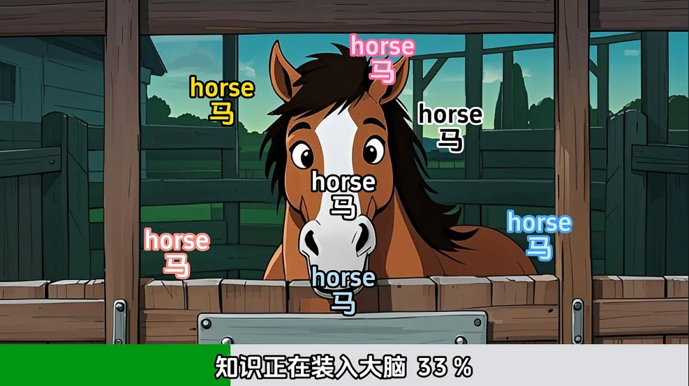
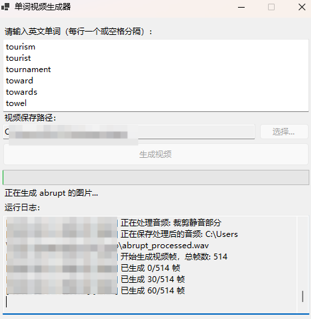

# 📚 Word Video Generator

 #Qwen3-coder Challenge#

[](LICENSE)
[]()
[]()
[]()

## Introduction
Word learning videos are commonly seen on short video platforms, such as:


However, the vocabulary used in these videos is often too simple, and some words are too obscure to meet current learning needs. Therefore, this software was developed to address these limitations.

Users can input words, and the system will automatically search for word definitions, images, and audio, then automatically generate videos and save them locally.

### Generated Example:
Please refer to the video in video/视频1.mp4

### Program Interface:


## 🌟 Project Overview

Word Video Generator is an innovative English learning tool that combines Alibaba Cloud's latest AI technology to provide users with personalized vocabulary learning videos. This project utilizes the following advanced technology stack:

- **🧠 Text Understanding**: Alibaba Cloud `qwen-flash` model - Provides precise word definitions and contextual understanding
- **🎨 Image Generation**: Alibaba Cloud `wan2.2-t2i-flash` model - Generates high-quality illustrations related to word meanings
- **🎬 Video Production**: FFmpeg - Combines text, images, and audio into learning videos

## ✨ Core Features

### 🚀 Smart Functionality
- **📝 Smart Definitions**: Utilizes qwen-flash model to provide accurate and concise Chinese definitions
- **🖼️ Visual Memory**: wan2.2-t2i-flash generates memory-related images associated with words  
- **🎥 Video Composition**: Automatically generates learning videos containing words, definitions, and images
- **⚡ Batch Processing**: Supports processing multiple words simultaneously for improved learning efficiency

### 💡 Technical Advantages
- **🔥 Latest Models**: Employs the latest high-performance models released by Alibaba Cloud
- **⚡ Lightning Response**: Flash version models provide faster response times
- **🎯 Precise Matching**: AI understands word context to generate the most appropriate visual content
- **📱 User-Friendly**: Simple and intuitive Windows desktop application interface

## 🛠️ Technology Stack

| Component | Technology | Purpose |
|-----------|------------|----------|
| **Frontend Interface** | C# WinForms | Desktop application interface |
| **Text AI** | Alibaba Cloud qwen-flash | Word definition generation |
| **Image AI** | Alibaba Cloud wan2.2-t2i-flash | Illustration generation |
| **Video Processing** | FFmpeg | Audio and video composition |
| **HTTP Client** | .NET HttpClient | API calls |

## 🚦 Quick Start

### 📋 System Requirements
- Windows 10/11
- .NET Framework 4.7.2+
- Valid Alibaba Cloud API key

### 🔧 Configuration Steps

1. **Obtain API Key**
   ```bash
   # Visit Alibaba Cloud console to get API key
   https://dashscope.console.aliyun.com/
   ```

2. **Configure API Key**
   ```csharp
   // Update your API key in Services/ApiService.cs
   private const string API_KEY = "YOUR_ALIBABA_CLOUD_API_KEY";
   ```

3. **Build and Run**
   ```bash
   # Build using Visual Studio or command line
   dotnet build
   dotnet run
   ```

### 📖 Usage Instructions

1. **Input Words**: Enter English words to learn in the text box
2. **Generate Content**: Click the "Generate" button, and the AI will automatically:
   - 🔍 Analyze word meanings
   - 📝 Generate Chinese definitions
   - 🎨 Create related illustrations
   - 🎬 Compose learning videos
3. **Save and Share**: Generated videos can be saved locally or shared with others

## 🎯 Project Highlights

### Project Advantages
- **Innovation**: First to combine text + image AI for vocabulary learning solutions
- **Practicality**: Addresses real pain points in English vocabulary memorization  
- **Technology**: Deep integration with Alibaba Cloud's latest AI capabilities
- **User Experience**: One-click generation, simple and easy to use


## 📁 Project Structure

```
WordVideoGenerator/
├── Services/
│   ├── ApiService.cs          # Alibaba Cloud API service wrapper
│   ├── LogService.cs          # Logging service  
│   └── VideoService.cs        # Video generation service
├── Models/
│   └── WordInfo.cs            # Word information model
├── Form1.cs                   # Main interface logic
├── Form1.Designer.cs          # Interface design file
├── Program.cs                 # Program entry point
└── README.md                  # Project documentation
```

## 🚀 Future Roadmap

- [ ] Support for more languages
- [ ] Integration of memory curve algorithms
- [ ] Support for custom video templates
- [ ] Cloud vocabulary synchronization


## 📄 Open Source License

This project is open sourced under the [MIT License](LICENSE).

---

<div align="center">

[](https://www.aliyun.com/)
[]()
[]()

</div>
