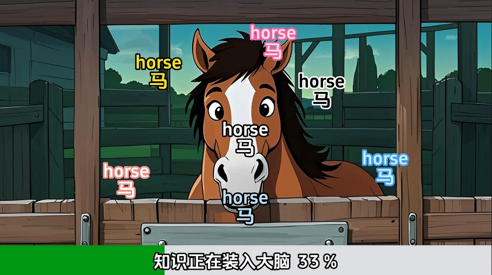
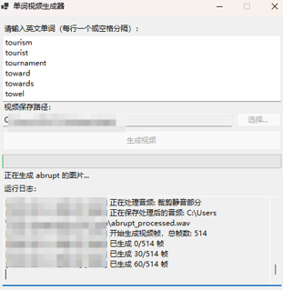

# 📚 单词视频生成器 Word Video Generator

 #Qwen3-coder挑战赛#

[](LICENSE)
[]()
[]()
[]()
## 前言
在短视频平台上会经常刷到类似于背单词的视频，例如
 
 
 但是其制作的单词过于简单，部分单词过于小众化，不能满足现在的学习需求，所以开发了这个软件
 用户可以输入单词，系统会自动搜索单词的释义、图片和音频，然后自动生成视频，并保存到本地。
### 生成效果：
参考video/视频1.mp4中的视频
### 程序界面：
 
## 🌟 项目简介

单词视频生成器是一款创新的英语学习工具，结合了阿里云最新的AI技术，为用户提供个性化的单词学习视频。本项目采用了以下先进技术栈：

- **🧠 文本理解**: 阿里云 `qwen-flash` 模型 - 提供精准的单词释义和语境理解
- **🎨 图像生成**: 阿里云 `wan2.2-t2i-flash` 模型 - 生成与单词含义相关的高质量插图
- **🎬 视频制作**: FFmpeg - 将文字、图像和音频合成为学习视频

## ✨ 核心特性

### 🚀 智能功能
- **📝 智能释义**: 利用 qwen-flash 模型提供准确、简洁的中文释义
- **🖼️ 视觉记忆**: wan2.2-t2i-flash 生成与单词相关的记忆图像  
- **🎥 视频合成**: 自动生成包含单词、释义、图片的学习视频
- **⚡ 批量处理**: 支持多个单词同时处理，提高学习效率

### 💡 技术优势
- **🔥 最新模型**: 采用阿里云最新发布的高性能模型
- **⚡ 极速响应**: flash 版本模型提供更快的响应速度
- **🎯 精准匹配**: AI理解单词语境，生成最贴切的视觉内容
- **📱 用户友好**: 简洁直观的Windows桌面应用界面

## 🛠️ 技术栈

| 组件 | 技术选型 | 作用 |
|------|---------|------|
| **前端界面** | C# WinForms | 桌面应用程序界面 |
| **文本AI** | 阿里云 qwen-flash | 单词释义生成 |
| **图像AI** | 阿里云 wan2.2-t2i-flash | 插图生成 |
| **视频处理** | FFmpeg | 音视频合成 |
| **HTTP客户端** | .NET HttpClient | API调用 |

## 🚦 快速开始

### 📋 环境要求
- Windows 10/11
- .NET Framework 4.7.2+
- 有效的阿里云API密钥

### 🔧 配置步骤

1. **获取API密钥**
   ```bash
   # 访问阿里云控制台获取API密钥
   https://dashscope.console.aliyun.com/
   ```

2. **配置密钥**
   ```csharp
   // 在 Services/ApiService.cs 中更新您的API密钥
   private const string API_KEY = "YOUR_ALIBABA_CLOUD_API_KEY";
   ```

3. **构建运行**
   ```bash
   # 使用 Visual Studio 或命令行构建
   dotnet build
   dotnet run
   ```

### 📖 使用说明

1. **输入单词**: 在文本框中输入要学习的英文单词
2. **生成内容**: 点击"生成"按钮，AI将自动：
   - 🔍 分析单词含义
   - 📝 生成中文释义
   - 🎨 创建相关插图
   - 🎬 合成学习视频
3. **保存分享**: 生成的视频可保存到本地或分享给他人

## 🎯 项目亮点

### 项目优势
- **创新性**: 首创结合文本+图像AI的单词学习方案
- **实用性**: 解决英语学习中记忆单词的实际痛点  
- **技术性**: 深度集成阿里云最新AI能力
- **用户体验**: 一键生成，简单易用


## 📁 项目结构

```
WordVideoGenerator/
├── Services/
│   ├── ApiService.cs          # 阿里云API服务封装
│   ├── LogService.cs          # 日志记录服务  
│   └── VideoService.cs        # 视频生成服务
├── Models/
│   └── WordInfo.cs            # 单词信息模型
├── Form1.cs                   # 主界面逻辑
├── Form1.Designer.cs          # 界面设计文件
├── Program.cs                 # 程序入口点
└── README.md                  # 项目说明文档
```

## 🚀 未来规划

- [ ] 支持更多语言
- [ ] 集成记忆曲线算法
- [ ] 支持自定义视频模板
- [ ] 云端单词库同步


## 📄 开源协议

本项目采用 [MIT 协议](LICENSE) 开源。

---

<div align="center">

[](https://www.aliyun.com/)
[]()
[]()

</div>
